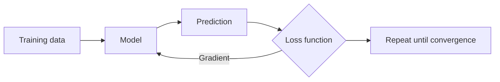
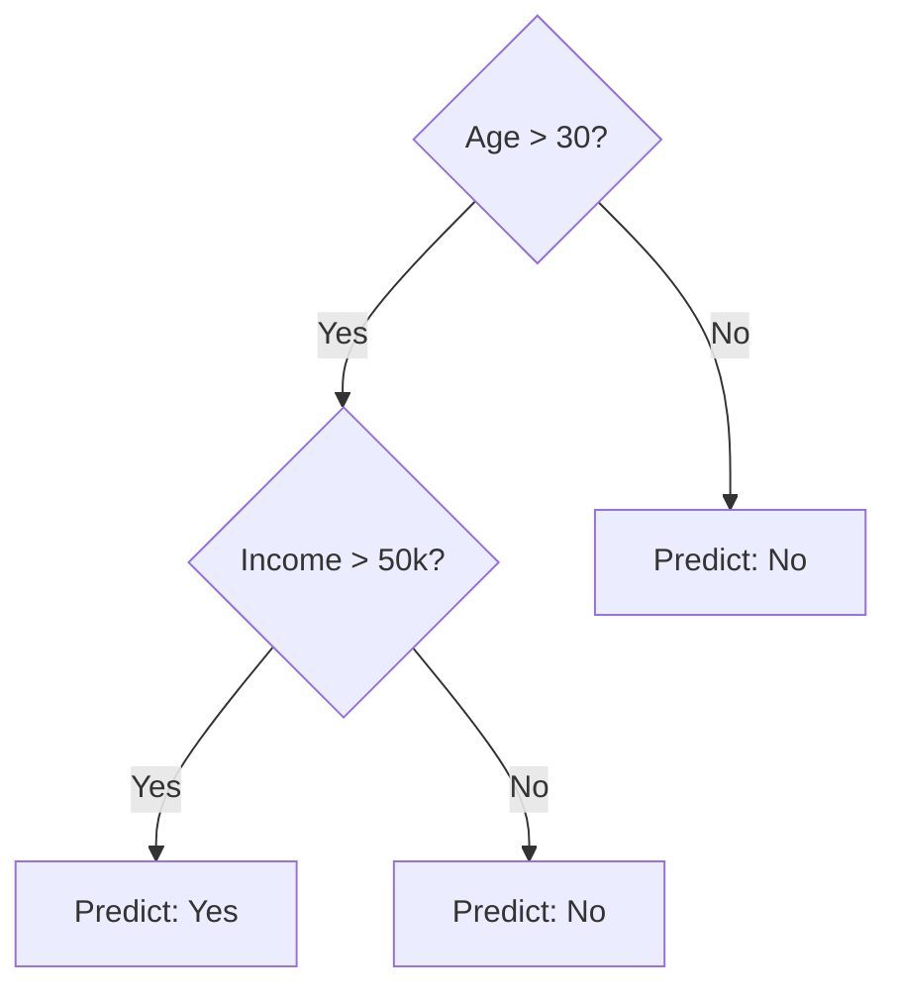

# Example: Classroom Slides

A lecture-style presentation demonstrating a mix of diagrams, tables, blockquotes, two-column comparisons, an auto-generated agenda, a callout, a citation, an embedded video, embedded polls, and speaker notes. Uses the `editorial` theme for a clean academic look.

Copy the source below into a new `.md` file and open it in Kova.

---

## Source

````markdown
# Introduction to Machine Learning

Lecture 3 — Supervised Learning

Dr. Priya Nair · CS 4810 · Spring 2026

---

## Today's agenda

!toc

???

Check: who has read Chapter 3? Show of hands.
If fewer than half: spend an extra 5 minutes on the recap.

---

## Recap

---

## What is a model?

> A model is a function that maps inputs to outputs —
> learned from data rather than hand-coded.
> — Bishop, *Pattern Recognition and Machine Learning*

???

Ask: "What's the difference between a model and a program?"
Expected answer: a program's logic is written by a human;
a model's logic is inferred from examples.

---

## Types of learning

**Supervised** — labelled training data

- Classification: "Is this email spam?"
- Regression: "What will the price be?"

|||

**Unsupervised** — no labels

- Clustering: "Which customers are similar?"
- Dimensionality reduction: "What's the structure?"

???

Keep this slide brief — the deep dive is next week. The point here is
just to locate supervised learning in the landscape.

---

## Supervised Learning

---

## The learning loop



???

Walk through each node. Emphasise that the model adjusts itself —
the programmer doesn't write the adjustment rules explicitly.

---

## Linear regression — intuition

We want to find the line of best fit through our data points.

Formally, we learn parameters **w** and **b** such that:

$$\hat{y} = w \cdot x + b$$

minimises the **mean squared error** over all training examples:

$$\text{MSE} = \frac{1}{n} \sum_{i=1}^{n} (y_i - \hat{y}_i)^2$$

---

## Linear regression — in Python

```python
from sklearn.linear_model import LinearRegression
import numpy as np

X = np.array([[1], [2], [3], [4], [5]])
y = np.array([2.1, 3.9, 6.2, 7.8, 10.1])

model = LinearRegression()
model.fit(X, y)

print(f"Slope:     {model.coef_[0]:.2f}")
print(f"Intercept: {model.intercept_:.2f}")
print(f"Predicted for x=6: {model.predict([[6]])[0]:.2f}")
```

---

## Decision trees — intuition

A decision tree partitions the feature space using a series of binary
questions. Each internal node is a feature split; each leaf is a prediction.



???

Good moment for an analogy: "Think of 20 Questions. The algorithm
figures out which questions to ask, and in what order, to sort your
training examples correctly."

---

## Comparing models

| | Linear regression | Decision tree |
|---|---|---|
| **Output type** | Continuous | Continuous or categorical |
| **Interpretable** | ✅ Easy | ✅ Easy |
| **Non-linear relationships** | ❌ | ✅ |
| **Sensitive to outliers** | ✅ Yes | Less so |
| **Prone to overfitting** | Rarely | Very much so |

---

## Overfitting

---

## What is overfitting?

> A model overfits when it learns the training data so well that
> it fails to generalise to new examples.

The model has memorised noise, not signal.

---

## Bias–variance tradeoff

!progress[High bias (underfitting)](20)
!progress[Just right](80)
!progress[High variance (overfitting)](100)

???

The bars here are illustrative — high variance means training accuracy
near 100%, test accuracy drops. The "just right" zone is what we're
aiming for.

---

## Remedies for overfitting

**Decision trees**

- Limit max depth (`max_depth=4`)
- Require minimum samples per leaf
- Prune after training

|||

**General techniques**

- More training data
- Cross-validation
- Regularisation (L1 / L2)
- Ensemble methods (next week)

---

## Quick check

!poll[Which model would you use for predicting house prices?](https://pollev.com/priya-nair-cs4810)

???

Give students 60 seconds to respond.
Expected winner: Linear regression (continuous output, interpretable).
Discuss why a decision tree would also work.

---

## Lab preview

In today's lab you will:

- Load the Boston Housing dataset
- Fit a linear regression model and a decision tree
- Evaluate both on a held-out test set
- Plot the bias–variance curves

> [!warning] Deadline
> Submit your notebook to Gradescope by **Friday 23:59**.

---

## Lab environment walkthrough

!video[Lab environment walkthrough](./assets/lab-walkthrough.mp4)

---

## Resources

- Course notes: Chapter 3 — Linear Models
- Scikit-learn docs: `sklearn.linear_model`, `sklearn.tree`

!ref[Bishop, C. (2006). Pattern Recognition and Machine Learning. Springer, Ch. 3.1–3.3.]

See you Thursday.

???

Office hours: Tuesday 14:00–16:00, Room 214.
TA sessions: Wednesday 18:00 on Discord.
````

---

## What this demonstrates

| Slide | Layout | Feature |
|-------|--------|---------|
| Title | `title` | Subtitle |
| "Today's agenda" | `two-column` | `!toc` auto-generated agenda (auto-splits — this deck has enough slides to overflow one column) |
| "Types of learning" | `two-column` | `\|\|\|` column break |
| "The learning loop" | `code` | Mermaid flowchart |
| "Linear regression — intuition" | `title-content` | Display math (`$$...$$`) |
| "Linear regression — in Python" | `code` | Python code block |
| "Decision trees — intuition" | `code` | Mixed text + Mermaid |
| "Comparing models" | `title-content` | GFM table |
| "Why now" | `quote` | Blockquote layout |
| "Bias–variance tradeoff" | `bsp` | Progress bar group |
| "Remedies" | `two-column` | Column break |
| "Quick check" | `media` | `!poll` QR code |
| "Lab preview" | `title-content` | `> [!warning]` callout |
| "Lab environment walkthrough" | `media` | `!video` local video embed |
| "Resources" | `title-content` | `!ref` academic-style citation |
| Speaker notes | — | `???` throughout |
