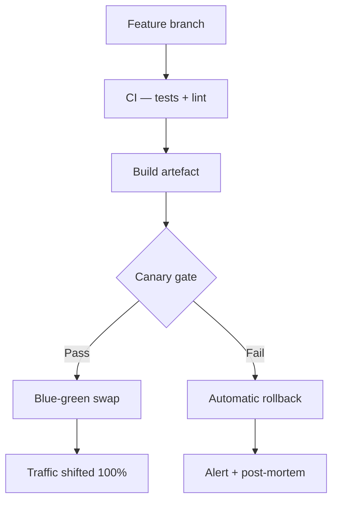

# Example: Technical Talk

A conference-style talk demonstrating the `code` layout, Mermaid diagrams, annotated code blocks, and the `split` and `full-bleed` layouts. Uses the `forge` theme for a technical aesthetic.

Copy the source below into a new `.md` file and open it in Kova.

---

## Source

````markdown
---
title: "Zero-downtime deploys at scale"
author: Marcus Lee
date: 2026
theme: forge
aspect_ratio: "16:9"
---

# Zero-downtime deploys at scale

How we ship 40× a day without waking anyone up.

Marcus Lee · SRE Summit 2026

---

## Agenda

- The old way and its costs
- Blue-green at scale
- Our canary pipeline
- Observability hooks
- What we got wrong first

---

## The old way

---

## Deploy night

- Feature freeze two weeks before release
- All-hands on a Friday evening
- 45-minute maintenance window
- Rollback plan: pray

> It worked in staging.
> — Every engineer, ever

???

Moment of recognition from the audience — most rooms have been there.
Hold for a beat before moving on.

---

## The cost

!progress[Engineering time in deploy coordination](38)
!progress[Incidents traced to deploy window](61)
!progress[Mean time to recover from bad deploy](79)

38% of our SRE time · 61% of P0 incidents · 4.5h avg MTTR

---

## The new approach

---

## Architecture overview



???

Walk through left to right. The canary gate is the key innovation —
the audience will ask about it. Save the detail for the next slide.

---

## The canary gate

```rust
pub struct CanaryGate {
    error_threshold: f64,   // (1)
    latency_p99_ms:  u64,   // (2)
    sample_window:   Duration,
}

impl CanaryGate {
    pub fn should_proceed(&self, metrics: &Metrics) -> Decision {
        if metrics.error_rate > self.error_threshold {
            return Decision::Rollback;         // (3)
        }
        if metrics.latency_p99 > self.latency_p99_ms {
            return Decision::Rollback;
        }
        Decision::Proceed
    }
}
```

???

(1) Defaults to 0.1% error rate
(2) 200ms p99 — tighter than our SLA to give headroom
(3) Rollback is synchronous and completes in < 30s

---

## Traffic shifting

```bash
# Shift 5% to canary
./shift.sh --canary 5

# Wait for gate evaluation (default: 10 min)
./gate.sh --wait

# On pass: shift 100% and retire blue
./shift.sh --canary 100 && ./retire.sh --blue
```

---

## Observability hooks

---

## What we instrument

- **Canary error rate** — compared against rolling 7-day baseline, not absolute threshold
- **p50 / p95 / p99 latency** — per-endpoint, not aggregate
- **DB query duration** — catches schema migration regressions
- **Memory growth rate** — catches slow leaks before they become OOMs

---

## Dashboard


Each deploy gets a unique ID surfaced in traces, logs, and the dashboard.
One click shows every error that occurred during the canary window.

???

We open-sourced the dashboard config — Grafana + Prometheus. Link in the
talk notes.

---

## What we got wrong first

---

## Mistake 1: comparing against a fixed threshold

**Wrong:** roll back if error rate > 0.1%

**Right:** roll back if error rate > baseline × 1.5

Traffic spikes make absolute thresholds fire constantly on perfectly
healthy deploys.

---

## Mistake 2: ignoring cold-start latency

<!-- layout:split -->


The first 60 seconds after a swap show artificially high latency due to
JIT warmup and cache priming. We now exclude that window from gate
evaluation.

---

## Mistake 3: insufficient canary traffic

| Traffic to canary | Time to detect P0 bug |
|:-----------------:|:---------------------:|
| 1% | ~40 min |
| 5% | ~8 min |
| 10% | ~4 min |
| 25% | ~90 sec |

We now send **10%** to canary by default — enough signal, not enough
blast radius.

---

## Results

!progress[Deploy frequency (40× / day)](100)
!progress[P0 incidents from deploys](15)
!progress[MTTR improvement](88)
!progress[SRE time freed from coordination](74)

40× / day · P0s from deploys down 85% · MTTR < 30 min · 74% coordination time saved

---

## Resources

- github.com/acme/canary-gate — open-source gate library
- grafana.com/dashboards/acme-deploy — dashboard config
- talk slides: acme.io/sre-summit-2026

Thank you.

???

Take questions. Common ones:
- "What's your rollback time?" — < 30 seconds, fully automated
- "What about DB migrations?" — expand-contract pattern, separate talk
- "How do you handle stateful services?" — good question, we don't (yet)
````

---

## What this demonstrates

| Slide | Layout | Feature |
|-------|--------|---------|
| Title | `title` | Theme and document settings |
| "The cost" | `bsp` | Multiple progress bars |
| "Architecture overview" | `code` | Mermaid flowchart |
| "The canary gate" | `code` | Rust syntax highlighting |
| "Traffic shifting" | `code` | Bash code block |
| "Dashboard" | `title-image` | Image-heavy slide |
| "Mistake 2" | `split` | Manual `<!-- layout:split -->` override |
| "Mistake 3" | `title-content` | GFM table |
| "Results" | `bsp` | Progress bar group |
| Speaker notes | — | `???` throughout |
