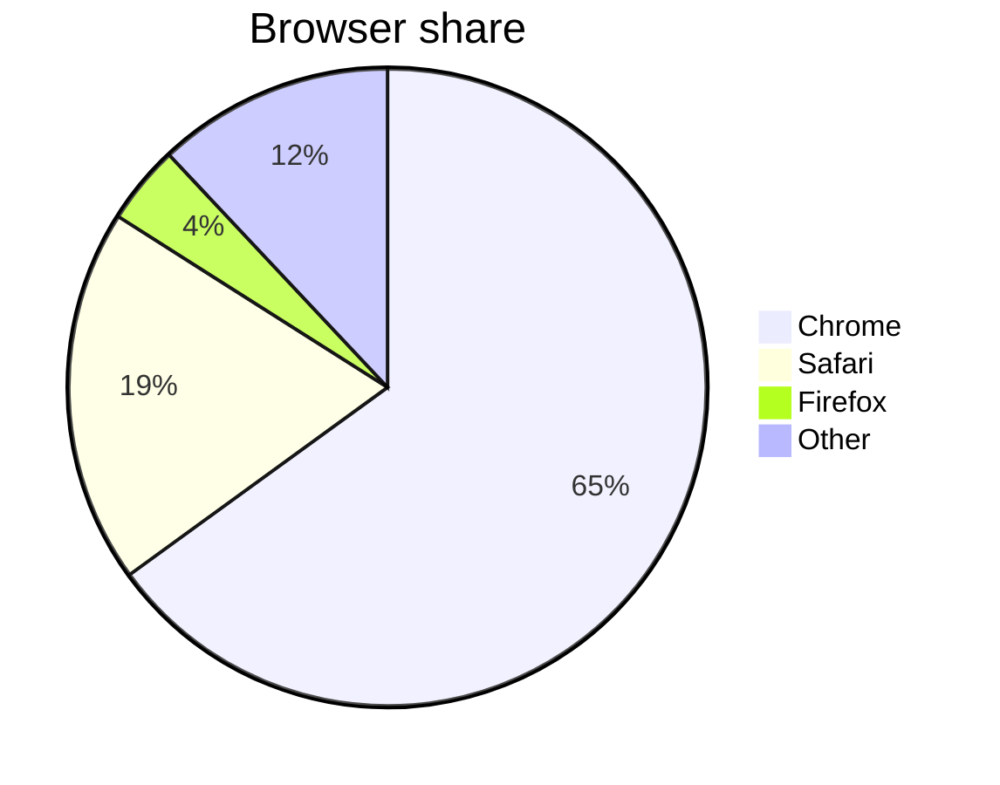
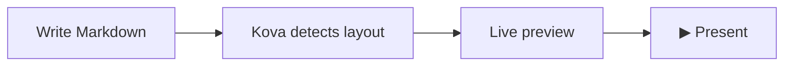

# Markdown & Syntax

Kova supports standard Markdown via [remark](https://remark.js.org/), GitHub Flavored Markdown (GFM) tables, Mermaid diagrams, LaTeX math via KaTeX, and a set of Kova-specific extensions for presentation content.

---

## Standard Markdown

### Headings

```markdown
# H1 — title slide (triggers the `title` layout)
## H2 — section break or slide heading
### H3 — sub-heading (renders as a paragraph-size label)
```

**Shortcuts:** `Ctrl+1` through `Ctrl+6` toggle heading levels on the current line. Pressing the same level again removes the heading marker.

---

### Text formatting

| Syntax | Result |
|--------|--------|
| `**bold**` | **bold** |
| `*italic*` | *italic* |
| `~~strikethrough~~` | ~~strikethrough~~ |
| `` `inline code` `` | `inline code` |

**Shortcuts:** `Ctrl+B` for bold, `Ctrl+I` for italic.

!!! tip "No selection needed"
    If no text is selected when you press `Ctrl+B` or `Ctrl+I`, Kova inserts a placeholder (`bold text` / `italic text`) with it pre-selected so you can type immediately.

---

### Lists

```markdown
- Unordered item
- Another item
  - Nested item (two spaces indent)

1. Ordered item
2. Second item
3. Third item
```

---

### Blockquote

```markdown
> The secret of getting ahead is getting started.
> — Mark Twain
```

Lines beginning with `—`, `–`, or `-` after the quote body are rendered as an attribution in a smaller typeface.

---

### Links and images

```markdown
[Link text](https://example.com)


```

**Image sizing** — use the title attribute to control width:

```markdown
      <!-- 50% of slide width -->
      <!-- fixed 300 px -->
         <!-- relative to font size -->
```

Supported units: `%`, `px`, `em`, `rem`, `cqi`.

---

### Code blocks

Fenced code blocks with syntax highlighting. Specify the language after the opening fence:

````markdown
```python
def greet(name: str) -> str:
    return f"Hello, {name}!"
```
````

Supported languages include Python, JavaScript, TypeScript, Rust, Go, SQL, Bash, and many more via [highlight.js](https://highlightjs.org/).

Slides containing only code blocks or Mermaid diagrams automatically use the `code` layout — a dark, full-width display optimised for readability.

---

### Tables (GFM)

```markdown
| Feature       | Status |
| ------------- | ------ |
| Live preview  | ✅     |
| Mermaid       | ✅     |
| Custom themes | ✅     |
```

!!! tip "Insert table dialog"
    Right-click in the editor and choose **Insert → Table** to open a dialog where you can set the number of rows and columns. Kova inserts a ready-to-fill GFM table at the cursor position.

---

### Horizontal rule

Use `<hr>` for a visual divider **within** a slide. Do **not** use `---` inside a slide — it is the slide separator.

```markdown
## My Slide

First section content.

<hr>

Second section content.
```

---

## Diagrams (Mermaid)

Fenced code blocks with the `mermaid` language identifier are rendered as diagrams, automatically themed to match the active presentation theme.

````markdown

````

````markdown

````

!!! tip
    See the [Mermaid documentation](https://mermaid.js.org/intro/) for all supported diagram types: flowcharts, sequence diagrams, Gantt charts, pie charts, class diagrams, and more.

---

## Math & LaTeX

Kova renders mathematical expressions using [KaTeX](https://katex.org/).

### Inline math

Wrap an expression in single dollar signs: `$...$`

```markdown
The derivative of $f(x) = x^2$ is $f'(x) = 2x$.
```

### Display math

Wrap a block equation in double dollar signs on their own lines: `$$...$$`

```markdown
$$
\text{MSE} = \frac{1}{n} \sum_{i=1}^{n} (y_i - \hat{y}_i)^2
$$
```

```markdown
$$
\sigma(x) = \frac{1}{1 + e^{-x}}
$$
```

!!! tip "Literal dollar signs"
    To display a literal `$` (e.g. a price), escape it with a backslash: `\$49.99`.

---

## Kova-specific syntax

### Column break (`|||`)

Force a two-column layout by placing `|||` between two content blocks on the same slide:

```markdown
## Comparing approaches

**Traditional tools**

- Manual layout adjustments
- Vendor lock-in
- Export quality varies

|||

**Kova**

- Layout detected automatically
- Plain `.md` files
- Native `.pptx` export
```

Kova splits the slide at the `|||` and renders each side as a column. See [Layouts — two-column](layouts.md#two-column) for details.

---

### Progress bars (`!progress`)

```markdown
!progress[Task Complete](75)
!progress[In Review](40)
!progress[Planned](10)
```

Numbers represent percentages from 0 to 100; decimals are allowed (`!progress[Almost there](99.5)`).

Multiple consecutive `!progress` bars are grouped as a single logical unit for layout detection — they won't accidentally trigger the `grid` layout.

---

### YouTube embed (`!youtube`)

```markdown
!youtube[Video Title](https://youtu.be/VIDEO_ID)
```

Displays the video thumbnail on the slide. During presentation, clicking the thumbnail opens the video in the default browser.

!!! note "Export behaviour"
    YouTube embeds export to PowerPoint as a text placeholder with the URL — not as an embedded video. In PDF export they appear as a static placeholder. See [Exporting](exporting.md#limitations_1).

---

### Poll / QR code (`!poll`)

```markdown
!poll[What is your biggest challenge?](https://pollev.com/your-poll)
```

Renders a scannable QR code pointing to the URL, plus the URL as text — useful for live audience interaction with [Poll Everywhere](https://polleverywhere.com) or any URL-based polling tool.

---

## Speaker notes

Add speaker notes below `???` on any slide. Notes are never visible to the audience.

```markdown
## Our Roadmap

- Q1: Public beta
- Q2: v1.0 release
- Q3: Plugin API

???

Pause here and ask the audience what features they most want to see.
Remember: the plugin API question usually sparks good discussion.
```

In **single-screen mode**, press `N` to toggle the notes panel.  
In **dual-screen mode**, notes appear permanently in the presenter overlay.

See [Presenting — Speaker Notes](presenting.md#speaker-notes) for more.

---

## Layout override

Force a specific layout regardless of content with an HTML comment at the top of the slide:

```markdown
<!-- layout:grid -->

## Hand-picked grid

- Item one
- Item two
- Item three
- Item four
```

Available layout names: `title`, `section`, `title-content`, `title-image`, `split`, `full-bleed`, `quote`, `two-column`, `bsp`, `grid`, `media`, `code`.

See [Layouts](layouts.md) for what each layout looks like and when Kova uses it automatically.
