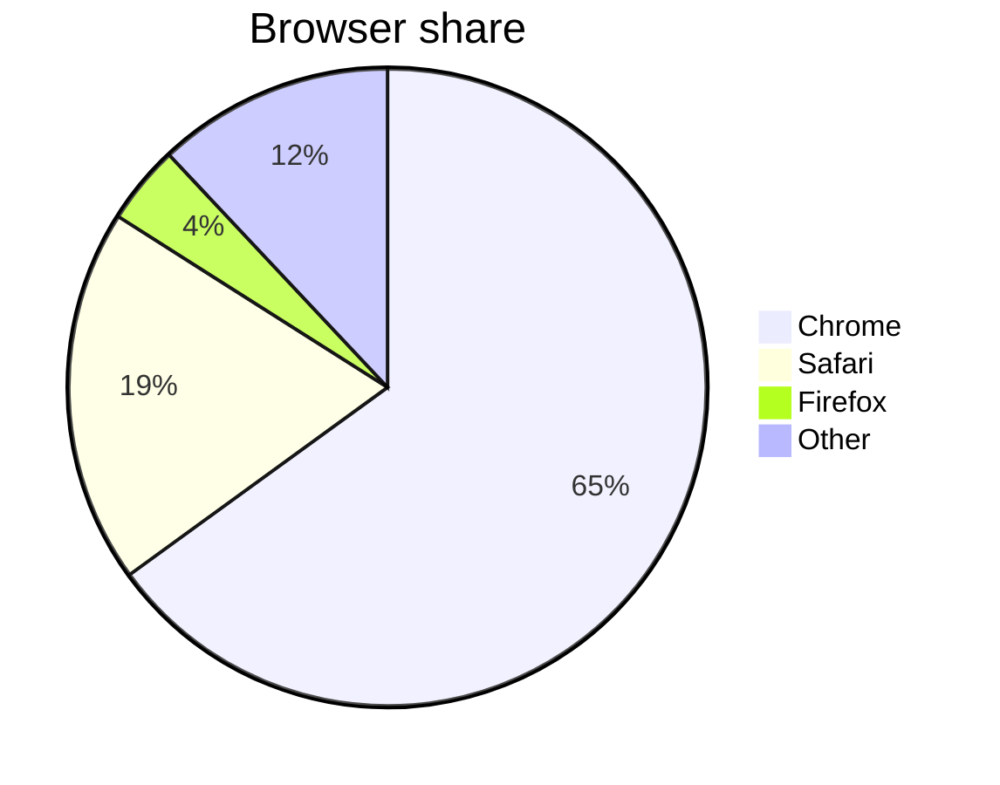
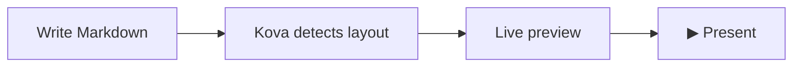

# Markdown & Syntax

Kova supports a set of presentation-specific Markdown extensions, plus standard Markdown via [remark](https://remark.js.org/), GitHub Flavored Markdown (GFM) tables, Mermaid diagrams, and LaTeX math via KaTeX.

---

## Kova-specific syntax

### Column break (`|||`)

Force a two-column layout by placing `|||` between two content blocks on the same slide:

```markdown
## Comparing approaches

**Traditional tools**

- Manual layout adjustments
- Vendor lock-in
- Export quality varies

|||

**Kova**

- Layout detected automatically
- Plain `.md` files
- Native `.pptx` export
```

Kova splits the slide at the `|||` and renders each side as a column. See [Layouts — two-column](layouts.md#two-column) for details.

!!! tip "Three columns"
    Add a **second** `|||` to split into three columns instead of two. See [Layouts — three-column](layouts.md#three-column).

---

### Progress bars (`!progress`)

```markdown
!progress[Task Complete](75)
!progress[In Review](40)
!progress[Planned](10)
```

Numbers represent percentages from 0 to 100; decimals are allowed (`!progress[Almost there](99.5)`).

Multiple consecutive `!progress` bars are grouped as a single logical unit for layout detection — they won't accidentally trigger the `grid` layout.

---

### YouTube embed (`!youtube`)

```markdown
!youtube[Video Title](https://youtu.be/VIDEO_ID)
```

Displays the video thumbnail on the slide. During presentation, clicking the thumbnail opens the video in the default browser.

!!! note "Export behaviour"
    YouTube embeds export to PowerPoint as a text placeholder with the URL — not as an embedded video. In PDF export they appear as a static placeholder. See [Exporting](exporting.md#limitations_1).

---

### Local video (`!video`)

```markdown
!video[Demo walkthrough](assets/demo.mp4)
```

Embeds a local video file, playable inline on the slide during presentation. Drag a video file onto the editor, or paste one from the clipboard, and Kova inserts the `!video[]()` reference automatically — the same drop/paste handling used for images (see [Getting Started](getting-started.md#step-7-open-and-insert-files)). Supported formats: `.mp4`, `.webm`, `.ogv`, `.mov`, `.m4v`, `.mkv`.

A video that's the **only** element on a slide gets the full-slide `media` layout (see [Layouts](layouts.md#media)). A video alongside other content instead flows through Kova's normal layout rules, the same as an image.

!!! note "Export behaviour"
    PDF and PowerPoint export can't play video: PDF export shows the video as a static frame, and PowerPoint export shows a text placeholder with the label and file path. **Standalone HTML export** is the exception — the video is embedded as a real, playable file. See [Exporting](exporting.md).

---

### Table of Contents (`!toc`)

```markdown
!toc
```

Renders a clickable list of every titled slide in the presentation — useful as an agenda or overview slide. The list is built automatically from your slide titles (the deck's opening title slide is excluded), so it stays in sync as you add, remove, or reorder slides.

By default entries are numbered; toggle **Table of contents → Numbered list** off in the Inspector's Document section for a plain, bare hyperlinked list instead. See [Themes — Inspector overrides](themes.md#inspector-overrides).

!!! tip "Insert via menu"
    Right-click in the editor and choose **Insert → Table of Contents** to add an `## Agenda` slide with `!toc` in one step.

During a presentation, clicking an entry jumps straight to that slide — from the presenter overlay, the single-screen view, or the audience display in dual-screen or mirror mode. A `!toc` list long enough to overflow the slide automatically splits into two columns, the same overflow handling used for dense text slides (see [Layouts](layouts.md#two-column)).

---

### Poll / QR code (`!poll`)

```markdown
!poll[What is your biggest challenge?](https://pollev.com/your-poll)
```

Renders a scannable QR code pointing to the URL, plus the URL as text — useful for live audience interaction with [Poll Everywhere](https://polleverywhere.com) or any URL-based polling tool. During a presentation, clicking the QR code also opens the URL in your system's default browser.

---

### Academic references (`!ref`)

Attach source citations to any slide using `!ref[...]` lines:

```markdown
!ref[Smith et al. (2024). *The Impact of AI on Education*. Journal of Learning Technologies, 12(3), 45–67.]
!ref[Jones, A. (2023). Pedagogical frameworks for Markdown-native tools. Open Education Review.]
```

References appear as small, muted text at the **bottom-right** of the slide, stacked vertically. They are styled to be unobtrusive — readable as annotations without competing with slide content. The colour automatically adapts to the active theme (greyed on light themes, softened white on dark themes).

Multiple `!ref` lines on the same slide are listed in the order they appear in the Markdown.

**PowerPoint export** — references are included in `.pptx` output as a 7 pt right-aligned text block placed just above the footer, so citations survive the export intact.

!!! tip "Insert via menu"
    In the editor, go to **Insert → Reference** (right-click menu) to place a `!ref[]` placeholder with the cursor inside, ready to type.

---

### Slide background images (`![bg]`)

Place a `` line anywhere on a slide to set a full-slide background image, Marp-style:

```markdown
## Quarterly results


Revenue is up 22% year over year.
```

| Syntax | Effect |
|--------|--------|
| `` | Full-slide background, cropped to fill (`cover`) |
| `` | Background fills the **left** half only; content occupies the right |
| `` | Background fills the **right** half only; content occupies the left |
| `` or `` | Background is scaled to fit without cropping instead of covering |

Only the first `![bg]` line on a slide is used, and the line is stripped from the rendered content — it doesn't affect layout detection or show up as a broken image. It's ignored inside fenced code blocks.

!!! tip "Set a background from the Slides panel"
    Right-click a slide thumbnail and choose **Set slide background…** to pick an image file without typing the syntax, or **Clear background** to remove it. This edits the underlying `![bg]` line for you.

Background images are included in PowerPoint export.

---

## Computed tables (`!sheet`)

Annotate a GFM table with `!sheet` and Kova computes it: formula cells like `=qty * unit` are evaluated live, on every keystroke. The source keeps the formulas, never the cached results, so a deck can't silently go stale when an input changes.

```markdown
!let vat = 0.255

!sheet
| item   | qty | unit  | total                   |
|--------|----:|------:|------------------------:|
| motor  |   2 | 12.50 | =qty * unit             |
| ESC    |   2 |  8.00 | =qty * unit             |
| !Total |     |       | =sum(total) * (1 + vat) |
```

This renders as an ordinary-looking table with every `=…` cell replaced by its computed value.

!!! note "`!sheet` must sit directly above the table"
    No blank line between them — `!sheet` annotates whichever table comes immediately next. A table with no `!sheet` line above it is left untouched, even if a cell's text starts with `=`.

### Row formulas vs. footer formulas

- A **data row** formula (`=qty * unit`) — a bare column name means *this row's* value in that column.
- A row whose first cell starts with `!` is a **footer row** (`| !Total | … |`) — the leading `!` is stripped when rendered. Inside a footer formula, a bare column name means *the whole column* (other footer rows are never counted in it).
- Column names come from the header: lowercased, punctuation dropped, spaces turned to underscores — `Unit (€)` becomes `unit`.

### Document-wide constants (`!let`)

```markdown
!let vat = 0.255
!let base = 10
```

Declare a `!let` anywhere in the document and every `!sheet` table in the file can reference it, regardless of which slide it's declared on. The right-hand side is a literal or an expression over *earlier* constants — never over table data.

### Operators and functions

| Category | Supported |
|----------|-----------|
| Arithmetic | `+` `-` `*` `/` `%` `^` (`^` is right-associative: `2^3^2` = 512, not 64) |
| Comparison | `==` `!=` `<` `<=` `>` `>=` |
| Logic | `and` `or` `not`, and the ternary `cond ? a : b` |
| Scalar functions | `round(x, n)`, `abs(x)`, `if(cond, a, b)`, `concat(...)` |
| Aggregate functions (footer rows only) | `sum` `avg` `min` `max` `count` `median` — each takes a whole column |

`*` and `/` bind tighter than `+` and `-`, and parentheses override both. Aggregate functions only work in a footer row, since they need a whole column and a data row only ever has scalar values in scope. A footer row is never counted as part of its own column, so `sum(total)` in the totals row can't add itself in.

### Precision

`!sheet` takes an optional `precision=N` option (default `2`):

```markdown
!sheet precision=6
| item | unit | share     |
|------|-----:|----------:|
| a    |    3 | =unit / 7 |
```

Whole-number results render without a decimal point regardless of the precision setting.

### Escaping

Inside a `!sheet` table, a cell that should start literally with `=` is escaped as `\=`, and a row label that really starts with `!` is escaped as `\!` — otherwise it's read as a footer row marker.

### Errors

A bad formula shows its error in that cell only (`#ERR …`) — the rest of the table still computes and the slide never goes blank. This matters because Kova re-parses on every keystroke, so a half-typed formula is a normal, transient state rather than a fatal one. Errors are preserved in PDF and PowerPoint export too, so a broken deck looks broken instead of quietly shipping a wrong number.

Common error cases: an unknown column name, an unknown function, divide-by-zero, the wrong number of arguments, a syntax error, or using an aggregate function (`sum`, etc.) in a data row instead of a footer row.

!!! tip "Degrades gracefully outside Kova"
    A sheet table is an ordinary GFM table under the hood, so opening the file in any other Markdown viewer still shows a valid table — just with the raw `=qty * unit` formula text in place of computed values, and a stray `!` in front of footer row labels.

`!include`, `!fmt`, and `!code` are reserved for future sheet directives and currently produce an error if used, so today's decks won't collide with them later.

---

## Diagrams (Mermaid)

Fenced code blocks with the `mermaid` language identifier are rendered as diagrams, automatically themed to match the active presentation theme.

````markdown

````

````markdown

````

!!! tip
    See the [Mermaid documentation](https://mermaid.js.org/intro/) for all supported diagram types: flowcharts, sequence diagrams, Gantt charts, pie charts, class diagrams, and more.

---

## Math & LaTeX

Kova renders mathematical expressions using [KaTeX](https://katex.org/).

### Inline math

Wrap an expression in single dollar signs: `$...$`

```markdown
The derivative of $f(x) = x^2$ is $f'(x) = 2x$.
```

### Display math

Wrap a block equation in double dollar signs on their own lines: `$$...$$`

```markdown
$$
\text{MSE} = \frac{1}{n} \sum_{i=1}^{n} (y_i - \hat{y}_i)^2
$$
```

```markdown
$$
\sigma(x) = \frac{1}{1 + e^{-x}}
$$
```

!!! tip "Literal dollar signs"
    To display a literal `$` (e.g. a price), escape it with a backslash: `\$49.99`.

---

## Figure captions (`!caption`)

Attach a caption to the image, Mermaid diagram, math block, or table **directly above** it:

```markdown

!caption[Figure 1: request flow through the ingest pipeline]
```

```markdown
$$
E = mc^2
$$
!caption[Equation 1: mass-energy equivalence]
```

```markdown
!sheet
| item   | qty | unit  | total       |
|--------|----:|------:|------------:|
| motor  |   2 | 12.50 | =qty * unit |
!caption[Table 1: bill of materials]
```

Kova merges the caption into the element it follows during parsing, so it never becomes ordinary body text — it can't accidentally trigger a `split`/`two-column` layout the way a trailing paragraph would. A `!caption` with no valid image, Mermaid diagram, math block, or table directly above it is a compile error rather than a silent no-op, the same convention as a misplaced `!sheet`.

Captions render centred underneath the element, in every layout that can hold one. On a `full-bleed` image, where the picture fills the whole slide, the caption sits in a bottom overlay bar instead. Captions survive PowerPoint export for all four element types.

---

## Standard Markdown

### Headings

```markdown
# H1 — title slide (triggers the `title` layout)
## H2 — section break or slide heading
### H3 — sub-heading (renders as a paragraph-size label)
```

**Shortcuts:** `Ctrl+1` through `Ctrl+6` toggle heading levels on the current line. Pressing the same level again removes the heading marker.

---

### Text formatting

| Syntax | Result |
|--------|--------|
| `**bold**` | **bold** |
| `*italic*` | *italic* |
| `~~strikethrough~~` | ~~strikethrough~~ |
| `` `inline code` `` | `inline code` |

**Shortcuts:** `Ctrl+B` for bold, `Ctrl+I` for italic.

!!! tip "No selection needed"
    If no text is selected when you press `Ctrl+B` or `Ctrl+I`, Kova inserts a placeholder (`bold text` / `italic text`) with it pre-selected so you can type immediately.

---

### Lists

```markdown
- Unordered item
- Another item
  - Nested item (two spaces indent)

1. Ordered item
2. Second item
3. Third item
```

---

### Blockquote

```markdown
> The secret of getting ahead is getting started.
> — Mark Twain
```

Lines beginning with `—`, `–`, or `-` after the quote body are rendered as an attribution in a smaller typeface.

#### Callouts / admonitions

Turn a blockquote into a coloured admonition box by starting it with a `[!type]` marker:

```markdown
> [!tip] Pro tip
> Press `Ctrl+B` with no selection to insert placeholder bold text.

> [!warning]
> Unsaved changes are lost if you close without saving.
```

The marker's first line becomes the box's title (defaulting to the capitalised type name if you don't supply one). Five canonical styles are supported — `note`, `tip`, `warning`, `danger`, `info` — and common synonyms are mapped onto them automatically:

| You write | Renders as |
|-----------|-----------|
| `caution`, `attention` | `warning` |
| `error`, `failure`, `fail`, `bug`, `missing` | `danger` |
| `question`, `help`, `faq` | `info` |
| `hint`, `important`, `success`, `check`, `done` | `tip` |
| `abstract`, `summary`, `tldr`, `quote`, `cite`, `example` | `note` |

A blockquote without a `[!type]` marker renders as a normal quote, as described above.

---

### Links and images

```markdown
[Link text](https://example.com)


```

**Image sizing** — use the title attribute to control width:

```markdown
      <!-- 50% of slide width -->
      <!-- fixed 300 px -->
         <!-- relative to font size -->
```

Supported units: `%`, `px`, `em`, `rem`, `cqi`.

!!! note "Link targets"
    A link with no scheme (`[text](example.com)`) defaults to `https://example.com`. During a presentation, clicking any link opens it in your system's default browser instead of navigating away from the presentation itself.

---

### Code blocks

Fenced code blocks with syntax highlighting. Specify the language after the opening fence:

````markdown
```python
def greet(name: str) -> str:
    return f"Hello, {name}!"
```
````

Supported languages include Python, JavaScript, TypeScript, Rust, Go, SQL, Bash, and many more via [highlight.js](https://highlightjs.org/).

Slides containing only code blocks or Mermaid diagrams automatically use the `code` layout — a dark, full-width display optimised for readability.

---

### Tables (GFM)

```markdown
| Feature       | Status |
| ------------- | ------ |
| Live preview  | ✅     |
| Mermaid       | ✅     |
| Custom themes | ✅     |
```

**Inline formatting in cells** — bold, italic, links, images, and inline math (`$...$`) all render correctly inside table cells:

```markdown
| Method | Formula | Notes |
|--------|---------|-------|
| **Mean** | $\bar{x} = \frac{\sum x_i}{n}$ | Sensitive to outliers |
| *Median* | middle value | More [robust](https://en.wikipedia.org/wiki/Robust_statistics) |
```

!!! tip "Insert table dialog"
    Right-click in the editor and choose **Insert → Table** to open a dialog where you can set the number of rows and columns. Kova inserts a ready-to-fill GFM table at the cursor position.

---

### Horizontal rule

Use `<hr>` for a visual divider **within** a slide. Do **not** use `---` inside a slide — it is the slide separator.

```markdown
## My Slide

First section content.

<hr>

Second section content.
```

---

## Speaker notes

Add speaker notes below `???` on any slide — never shown to the audience.

```markdown
## Our Roadmap

- Q1: Public beta
- Q2: v1.0 release
- Q3: Plugin API

???

Pause here and ask the audience what features they most want to see.
```

See [Presenting — Speaker Notes](presenting.md#speaker-notes) for how notes appear during a presentation.

---

## Layout override

Force a specific layout regardless of content with an HTML comment at the top of the slide:

```markdown
<!-- layout:grid -->

## Hand-picked grid
```

See [Layouts — Manual override](layouts.md#manual-override) for the full list of layout names and how automatic detection works.

---

## Per-slide text colour

Override text colour on an individual slide with an HTML comment:

```markdown
<!-- color: #fff -->

## Dark background slide
```

`<!-- _color: white -->` (Marp's own syntax) is also recognised and sets the same colour — a Marp deck that already uses `_color` keeps its per-slide colours on import. Accepts hex (`#rgb`, `#rrggbb`, `#rrggbbaa`), functional notations (`rgb()`, `hsl()`, …), and named CSS colours; functional notations are normalised to hex for PowerPoint export.

Alternatively, invert to the deck's inverted palette instead of choosing a colour by hand:

```markdown
<!-- _class: invert -->
```

Either directive is honoured in the live preview and PowerPoint export, across every layout — split, two-column, three-column, BSP, grid, and media. Headings and bold text follow the same override by default; to colour them independently, see [Themes — per-slide-scoped heading and bold colour](themes.md#per-slide-scoped-heading-and-bold-colour).

!!! tip "Exceptions, not the deck-wide default"
    Per-slide colour is for a handful of exceptions — typically slides with a photo [`![bg]`](#slide-background-images-bg). If most of the deck needs the same colour, change **Text** / **Title text** in the Inspector instead ([Themes — Inspector overrides](themes.md#inspector-overrides)), which applies deck-wide.
