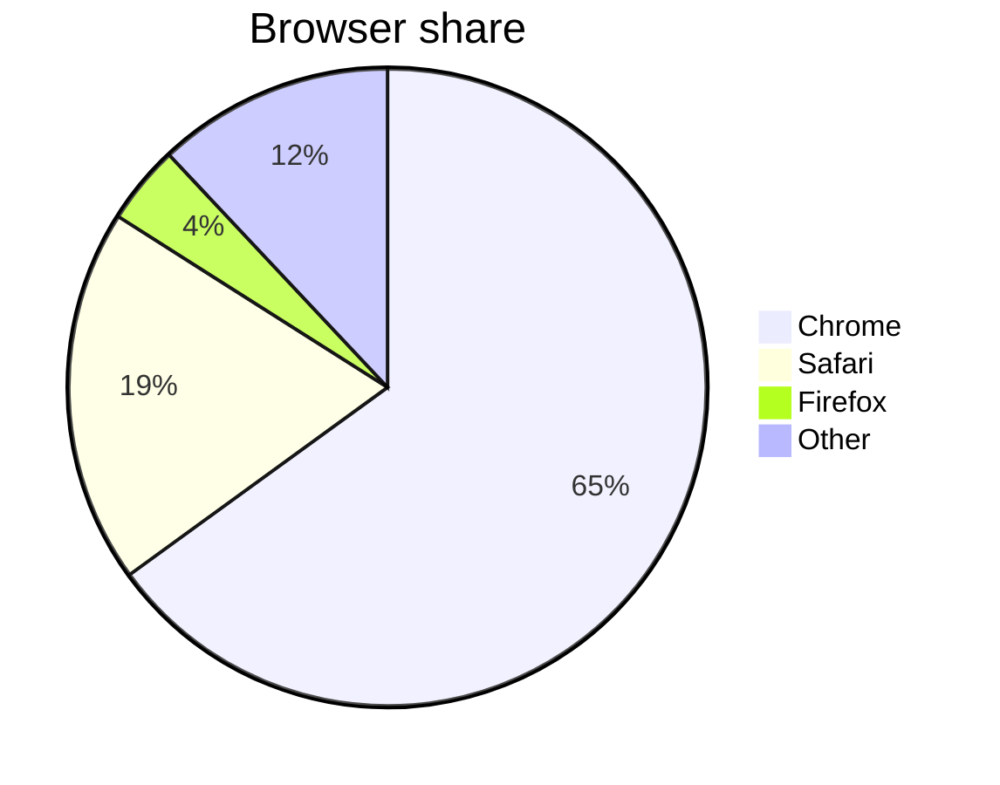
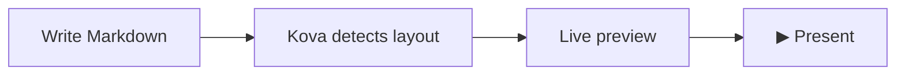

# Markdown & Syntax

Kova supports a set of presentation-specific Markdown extensions, plus standard Markdown via [remark](https://remark.js.org/), GitHub Flavored Markdown (GFM) tables, Mermaid diagrams, and LaTeX math via KaTeX.

---

## Kova-specific syntax

### Column break (`|||`)

Force a two-column layout by placing `|||` between two content blocks on the same slide:

```markdown
## Comparing approaches

**Traditional tools**

- Manual layout adjustments
- Vendor lock-in
- Export quality varies

|||

**Kova**

- Layout detected automatically
- Plain `.md` files
- Native `.pptx` export
```

Kova splits the slide at the `|||` and renders each side as a column. See [Layouts — two-column](layouts.md#two-column) for details.

---

### Progress bars (`!progress`)

```markdown
!progress[Task Complete](75)
!progress[In Review](40)
!progress[Planned](10)
```

Numbers represent percentages from 0 to 100; decimals are allowed (`!progress[Almost there](99.5)`).

Multiple consecutive `!progress` bars are grouped as a single logical unit for layout detection — they won't accidentally trigger the `grid` layout.

---

### YouTube embed (`!youtube`)

```markdown
!youtube[Video Title](https://youtu.be/VIDEO_ID)
```

Displays the video thumbnail on the slide. During presentation, clicking the thumbnail opens the video in the default browser.

!!! note "Export behaviour"
    YouTube embeds export to PowerPoint as a text placeholder with the URL — not as an embedded video. In PDF export they appear as a static placeholder. See [Exporting](exporting.md#limitations_1).

---

### Local video (`!video`)

```markdown
!video[Demo walkthrough](assets/demo.mp4)
```

Embeds a local video file, playable inline on the slide during presentation. Drag a video file onto the editor, or paste one from the clipboard, and Kova inserts the `!video[]()` reference automatically — the same drop/paste handling used for images (see [Getting Started](getting-started.md#step-7-open-and-insert-files)). Supported formats: `.mp4`, `.webm`, `.ogv`, `.mov`, `.m4v`, `.mkv`.

!!! note "Export behaviour"
    PDF and PowerPoint export can't play video: PDF export shows the video as a static frame, and PowerPoint export shows a text placeholder with the label and file path. **Standalone HTML export** is the exception — the video is embedded as a real, playable file. See [Exporting](exporting.md).

---

### Table of Contents (`!toc`)

```markdown
!toc
```

Renders a numbered, clickable list of every titled slide in the presentation — useful as an agenda or overview slide. The list is built automatically from your slide titles (the deck's opening title slide is excluded), so it stays in sync as you add, remove, or reorder slides.

!!! tip "Insert via menu"
    Right-click in the editor and choose **Insert → Table of Contents** to add an `## Agenda` slide with `!toc` in one step.

During a presentation, clicking an entry jumps straight to that slide — from the presenter overlay, the single-screen view, or the audience display in dual-screen or mirror mode. A `!toc` list long enough to overflow the slide automatically splits into two columns, the same overflow handling used for dense text slides (see [Layouts](layouts.md#two-column)).

---

### Poll / QR code (`!poll`)

```markdown
!poll[What is your biggest challenge?](https://pollev.com/your-poll)
```

Renders a scannable QR code pointing to the URL, plus the URL as text — useful for live audience interaction with [Poll Everywhere](https://polleverywhere.com) or any URL-based polling tool.

---

### Academic references (`!ref`)

Attach source citations to any slide using `!ref[...]` lines:

```markdown
!ref[Smith et al. (2024). *The Impact of AI on Education*. Journal of Learning Technologies, 12(3), 45–67.]
!ref[Jones, A. (2023). Pedagogical frameworks for Markdown-native tools. Open Education Review.]
```

References appear as small, muted text at the **bottom-right** of the slide, stacked vertically. They are styled to be unobtrusive — readable as annotations without competing with slide content. The colour automatically adapts to the active theme (greyed on light themes, softened white on dark themes).

Multiple `!ref` lines on the same slide are listed in the order they appear in the Markdown.

**PowerPoint export** — references are included in `.pptx` output as a 7 pt right-aligned text block placed just above the footer, so citations survive the export intact.

!!! tip "Insert via menu"
    In the editor, go to **Insert → Reference** (right-click menu) to place a `!ref[]` placeholder with the cursor inside, ready to type.

---

## Diagrams (Mermaid)

Fenced code blocks with the `mermaid` language identifier are rendered as diagrams, automatically themed to match the active presentation theme.

````markdown

````

````markdown

````

!!! tip
    See the [Mermaid documentation](https://mermaid.js.org/intro/) for all supported diagram types: flowcharts, sequence diagrams, Gantt charts, pie charts, class diagrams, and more.

---

## Math & LaTeX

Kova renders mathematical expressions using [KaTeX](https://katex.org/).

### Inline math

Wrap an expression in single dollar signs: `$...$`

```markdown
The derivative of $f(x) = x^2$ is $f'(x) = 2x$.
```

### Display math

Wrap a block equation in double dollar signs on their own lines: `$$...$$`

```markdown
$$
\text{MSE} = \frac{1}{n} \sum_{i=1}^{n} (y_i - \hat{y}_i)^2
$$
```

```markdown
$$
\sigma(x) = \frac{1}{1 + e^{-x}}
$$
```

!!! tip "Literal dollar signs"
    To display a literal `$` (e.g. a price), escape it with a backslash: `\$49.99`.

---

## Standard Markdown

### Headings

```markdown
# H1 — title slide (triggers the `title` layout)
## H2 — section break or slide heading
### H3 — sub-heading (renders as a paragraph-size label)
```

**Shortcuts:** `Ctrl+1` through `Ctrl+6` toggle heading levels on the current line. Pressing the same level again removes the heading marker.

---

### Text formatting

| Syntax | Result |
|--------|--------|
| `**bold**` | **bold** |
| `*italic*` | *italic* |
| `~~strikethrough~~` | ~~strikethrough~~ |
| `` `inline code` `` | `inline code` |

**Shortcuts:** `Ctrl+B` for bold, `Ctrl+I` for italic.

!!! tip "No selection needed"
    If no text is selected when you press `Ctrl+B` or `Ctrl+I`, Kova inserts a placeholder (`bold text` / `italic text`) with it pre-selected so you can type immediately.

---

### Lists

```markdown
- Unordered item
- Another item
  - Nested item (two spaces indent)

1. Ordered item
2. Second item
3. Third item
```

---

### Blockquote

```markdown
> The secret of getting ahead is getting started.
> — Mark Twain
```

Lines beginning with `—`, `–`, or `-` after the quote body are rendered as an attribution in a smaller typeface.

---

### Links and images

```markdown
[Link text](https://example.com)


```

**Image sizing** — use the title attribute to control width:

```markdown
      <!-- 50% of slide width -->
      <!-- fixed 300 px -->
         <!-- relative to font size -->
```

Supported units: `%`, `px`, `em`, `rem`, `cqi`.

---

### Code blocks

Fenced code blocks with syntax highlighting. Specify the language after the opening fence:

````markdown
```python
def greet(name: str) -> str:
    return f"Hello, {name}!"
```
````

Supported languages include Python, JavaScript, TypeScript, Rust, Go, SQL, Bash, and many more via [highlight.js](https://highlightjs.org/).

Slides containing only code blocks or Mermaid diagrams automatically use the `code` layout — a dark, full-width display optimised for readability.

---

### Tables (GFM)

```markdown
| Feature       | Status |
| ------------- | ------ |
| Live preview  | ✅     |
| Mermaid       | ✅     |
| Custom themes | ✅     |
```

**Inline formatting in cells** — bold, italic, links, images, and inline math (`$...$`) all render correctly inside table cells:

```markdown
| Method | Formula | Notes |
|--------|---------|-------|
| **Mean** | $\bar{x} = \frac{\sum x_i}{n}$ | Sensitive to outliers |
| *Median* | middle value | More [robust](https://en.wikipedia.org/wiki/Robust_statistics) |
```

!!! tip "Insert table dialog"
    Right-click in the editor and choose **Insert → Table** to open a dialog where you can set the number of rows and columns. Kova inserts a ready-to-fill GFM table at the cursor position.

---

### Horizontal rule

Use `<hr>` for a visual divider **within** a slide. Do **not** use `---` inside a slide — it is the slide separator.

```markdown
## My Slide

First section content.

<hr>

Second section content.
```

---

## Speaker notes

Add speaker notes below `???` on any slide — never shown to the audience.

```markdown
## Our Roadmap

- Q1: Public beta
- Q2: v1.0 release
- Q3: Plugin API

???

Pause here and ask the audience what features they most want to see.
```

See [Presenting — Speaker Notes](presenting.md#speaker-notes) for how notes appear during a presentation.

---

## Layout override

Force a specific layout regardless of content with an HTML comment at the top of the slide:

```markdown
<!-- layout:grid -->

## Hand-picked grid
```

See [Layouts — Manual override](layouts.md#manual-override) for the full list of layout names and how automatic detection works.
